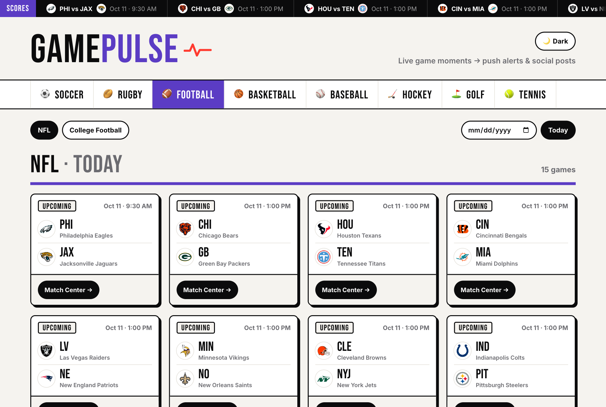
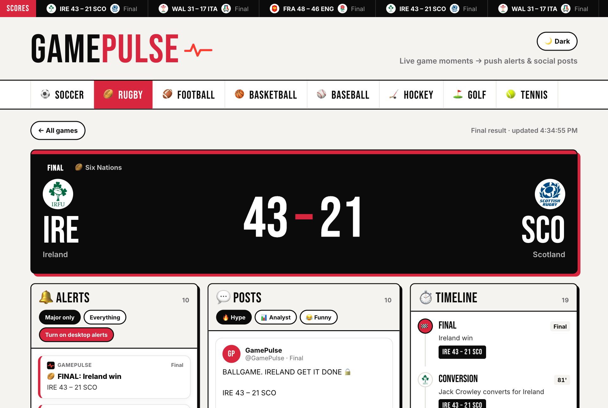
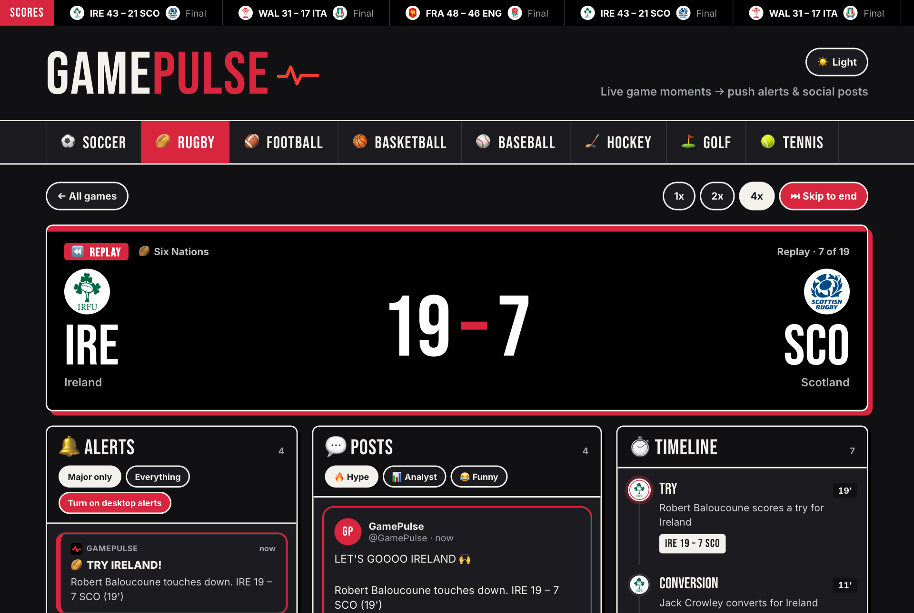
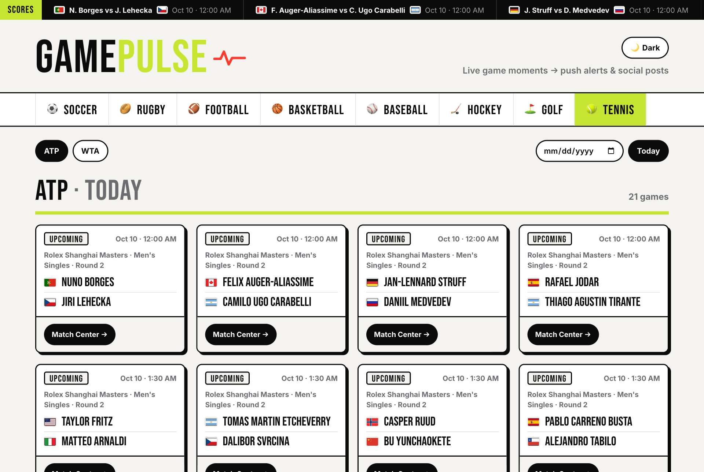
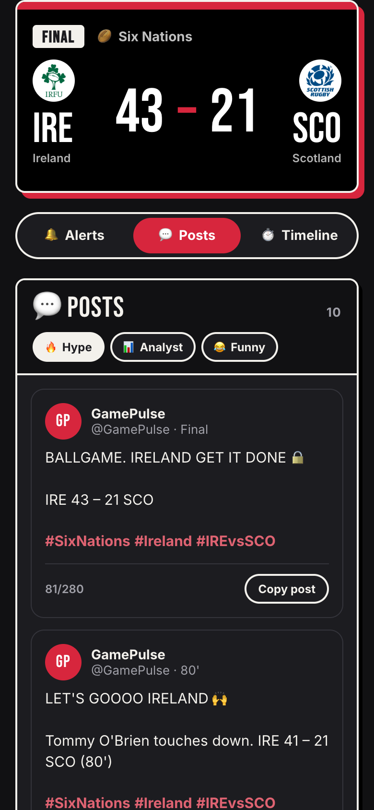
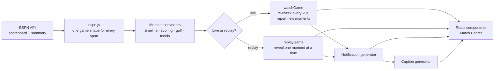

# GamePulse

**GamePulse is a React web app that turns live sports into fan content.** It follows real games across eight sports, detects the moments that matter (goals, tries, touchdowns, eagles, set wins) and instantly writes a **push notification** and a **social media post** for each one, the way a sports media team at a site like Bleacher Report would.



## Features

- **Live data from 8 sports, 15 leagues.** Soccer (Premier League, Champions League, MLS), rugby (Six Nations, Premiership, Rugby World Cup), football (NFL, college), basketball (NBA, WNBA), baseball (MLB), hockey (NHL), golf (PGA Tour) and tennis (ATP, WTA).
- **Live updates.** An open game is re-checked every 20 seconds and only *new* moments are announced.
- **Replay mode.** Any finished game can be replayed moment by moment at 1x, 2x or 4x, so the app always has something to show, even when nothing is live.
- **Push notifications.** Short, urgent alerts with sport-specific wording (*"🏉 IRELAND GO OVER! Jamie Osborne touches down. IRE 5 – 0 SCO (3')"*). They can also appear as real desktop notifications.
- **Social posts in three tones.** Hype, analyst or funny, with league, team and matchup hashtags, always within X's 280-character limit, and copyable with one click.
- **Match Center.** A scoreboard with team logos, plus alerts, posts and a timeline side by side.
- **Any date.** A date picker loads past games to browse or replay.
- **Light and dark mode**, remembered between visits.
- **Responsive.** On narrow screens the Match Center panels become tabs.

## Screenshots

| Match Center | Replay in dark mode |
| --- | --- |
|  |  |

| Tennis with player flags | Narrow screen |
| --- | --- |
|  |  |

### The same moment, three ways

A Colts touchdown, as a push notification and as a post in each tone:

```
🔔  🏈 TOUCHDOWN! COLTS
    Jonathan Taylor 5-yard run. IND 7 – 6 WSH (Q2 3:23)
```

| 🔥 Hype | 📊 Analyst | 😂 Funny |
| --- | --- | --- |
| 🏈 TOUCHDOWN! COLTS 🔥🔥🔥<br><br>Jonathan Taylor 5-yard run. IND 7 – 6 WSH (Q2 3:23)<br><br>#NFL #Colts #INDvsWSH | 🏈 Rushing Touchdown, Colts.<br><br>Jonathan Taylor 5-yard run. IND 7 – 6 WSH (Q2 3:23)<br><br>Colts now lead by 1.<br><br>#NFL #Colts #INDvsWSH | The group chat is going OFF right now 📱📱📱<br><br>Jonathan Taylor 5-yard run. IND 7 – 6 WSH (Q2 3:23)<br><br>#NFL #Colts #INDvsWSH |

## How it works



### 1. One data shape for eight sports

All data comes from ESPN's public JSON API (`site.api.espn.com`), which needs no key. Each sport is shaped differently, though: a soccer match is one event, a tennis "event" is a whole tournament with hundreds of matches, and a golf event is a leaderboard. [`src/api/espn.js`](src/api/espn.js) converts every sport into the same **game** object (status, competitors, scores, logos), so the rest of the app never needs to know which sport it is showing.

### 2. Moments: the core idea

A **moment** is anything worth telling fans about, in one format for every sport:

```js
{
  id: '602514-3\'-try-3-Jamie Osborne-1',  // stable, so it's never announced twice
  type: 'score',                            // score, card, period, final, eagle, set, ...
  label: 'Try',
  major: true,                              // big moments trigger alerts and posts
  team: { name: 'Ireland', nickname: 'Ireland', shortName: 'IRE', logo: '…' },
  player: 'Jamie Osborne',
  text: 'Jamie Osborne scores a try for Ireland',
  score: 'IRE 5 – 0 SCO',
  clock: "3'",
}
```

Each sport has a converter in [`src/moments/`](src/moments/), because each one gives different raw data:

| Kind | Sports | How moments are found |
| --- | --- | --- |
| `timeline` | Soccer, rugby | ESPN gives a list of match events but no running score, so the converter adds the score up as it goes (rugby: try 5, conversion 2, penalty or drop goal 3). Substitutions are skipped. |
| `scoring` | NFL, NBA, MLB, NHL | Uses scoring plays from the game summary. Basketball has 100+ baskets a game, so only lead changes, dunks and clutch threes (4th quarter, within 5 points) are kept. NHL shootout plays are skipped because they restart the count. |
| `leaderboard` | Golf | There are no plays, only hole-by-hole scores. The converter walks each top-10 player's holes in order to find holes-in-one, eagles, 3-birdie streaks and double bogeys, keeping each player's running score to par. |
| `sets` | Tennis | Each finished set becomes a moment (including tiebreaks, e.g. `7-6(5)`), followed by the match result. |

### 3. Live updates and replay

- [`watchGame`](src/live/watchGame.js) re-fetches a game every 20 seconds while live (every 60 seconds before it starts, never once it's finished). Moment IDs are stable, so "new" just means an ID it hasn't seen before. The first load counts as history, so opening a game doesn't fire a burst of old alerts. A failed request is retried on the next check instead of ending live updates.
- [`replayGame`](src/live/replayGame.js) loads a finished game's moments once and reveals them on a timer. It sends updates in the **same format** as `watchGame`, so notifications, posts and the timeline treat a replay exactly like a live game. The scoreboard follows the replayed score instead of the final result, so a replay never spoils the ending.
- [`useLiveMoments`](src/hooks/useLiveMoments.js) wraps both for React. Replay speed is read from a ref, so changing speed doesn't restart the replay.

### 4. Writing the content

- **Notifications** ([`src/content/notifications.js`](src/content/notifications.js)) use a template per moment type, such as *TRY*, *PICK-SIX*, *HOME RUN*, *EAGLE* or *Set to …*. Raw ESPN text is rewritten into plain English (`"5 Yd Rush (Shrader Kick)"` → `"5-yard run"`). Where there are several phrasings, one is chosen from a hash of the moment ID, so a moment always gets the same wording when the page re-renders.
- **Captions** ([`src/content/captions.js`](src/content/captions.js)) build on the notification so the facts always match. They add context (*"Colts now lead by 1"*, *"Winning margin: 22"*), a joke about the other team in the funny tone, and hashtags for the league, scoring team and matchup (or the players in golf and tennis). If a post would go over 280 characters, hashtags are dropped first.

### 5. Front end

- **React 19 + Vite**, with no UI framework: components are styled with plain CSS files kept next to them.
- **Design tokens** live in CSS custom properties. Each sport sets `--accent`, so picking a sport recolors the tabs, headings, ticker label, buttons and posts.
- **Dark mode** swaps the token values under `[data-theme='dark']`. A small inline script in `index.html` applies the saved or system theme before the page draws, so the wrong theme never flashes.
- **Logos** are shown on a white circle so dark logos stay visible on dark backgrounds, and they hide themselves if an image fails to load.
- **Accessibility:** tabs use `role="tab"` and `aria-selected`, toggles use `aria-pressed`, and animations turn off under `prefers-reduced-motion`.

## Project structure

```
src/
├── api/espn.js            ESPN requests → one game shape for every sport
├── data/sports.js         Sports, leagues, ESPN paths, colors, hashtags
├── moments/               Game data → moments (one converter per kind of sport)
├── live/                  watchGame (live updates) and replayGame
├── content/               Notification and caption generators
├── hooks/                 useGames, useLiveMoments, useBrowserNotifications, useTheme
└── components/            UI: Header, Ticker, SportPicker, LeagueBar, GameList, GameCard,
                           GameView (Match Center), MatchHeader, NotificationFeed,
                           CaptionFeed, MomentFeed, TeamLogo, …
```

## Running it locally

You need [Node.js](https://nodejs.org/) 20.19+ or 22.12+ (required by Vite 8).

```bash
git clone https://github.com/StaceyA132/Game-Pulse.git
cd Game-Pulse
npm install
npm run dev
```

Then open the link Vite prints (usually http://localhost:5173).

| Command | What it does |
| --- | --- |
| `npm run dev` | Start the development server |
| `npm run build` | Build for production into `dist/` |
| `npm run preview` | Serve the production build locally |
| `npm run lint` | Lint the code with oxlint |

**Tip:** if no games are live, pick a finished game and press **⏪ Replay**, or use the date picker to load a past matchday.

## Notes and limitations

- **Unofficial data source.** ESPN's API isn't officially documented and could change. Team logos and data belong to their owners; this is a non-commercial portfolio project.
- **The tab must stay open.** Updates and desktop notifications only run while the page is open in a browser tab. Notifications that arrive when the site is closed would need a server and Web Push.
- **One game at a time.** The Match Center follows the game you open.
- **No automated tests yet.** The moment converters, notifications and captions were checked against real finished games from every sport, and the UI was checked in Chrome, but those checks aren't part of the repository yet.

## What's next

- An **iOS app in Swift** for real lock-screen push notifications
- **Follow a team** to get alerts from all of its games
- Automated tests for the moment converters and content generators
